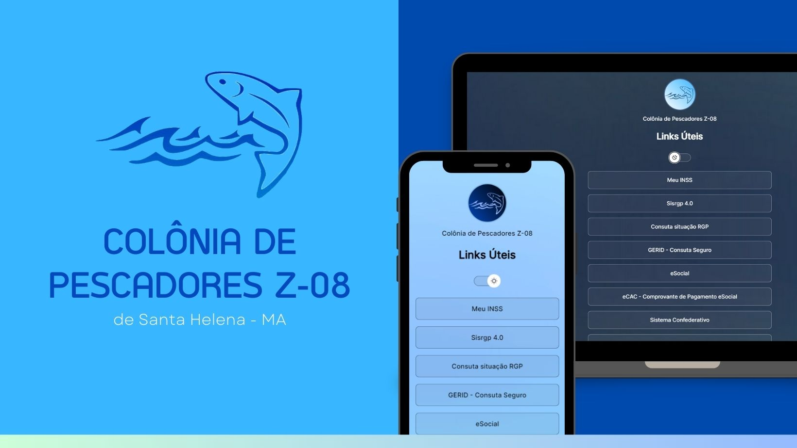

<h1 align="center"> Links Z-08 </h1>

Página adaptada apartir do projeto DevLinks e apresentada como projeto final do curso Discover promovido pela Rocketseat para ensino de tecnologias WEB.

  <a href="#-tecnologias">Tecnologias</a>&nbsp;&nbsp;&nbsp;|&nbsp;&nbsp;&nbsp;
  <a href="#-projeto">Projeto</a>&nbsp;&nbsp;&nbsp;

 

  

## 🚀 Tecnologias

Esse projeto foi desenvolvido com as seguintes tecnologias:

- HTML e CSS
- JavaScript
- Git e Github

## 💻 Projeto

O Links Z-08 é um agregador de links adaptado com a finalidade de agrupar e organizar os links dos principais sites utilizado no meu ambiente de trabalho.

---

Adaptado por Italo Costa :wave: